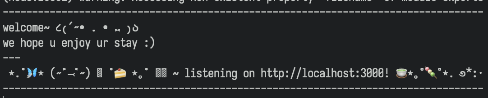
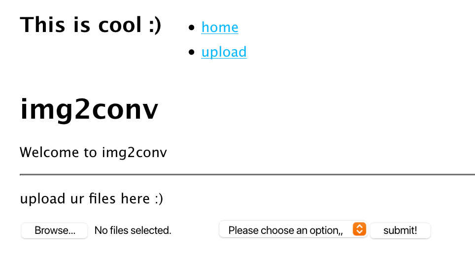

# img2conv
image conversion without the paywalls

i made this tool to rip texture files from games and put it in a website

go [here to https://img.nataziel.nexus](https://img.nataziel.nexus) and try it :)
just dump a whole folder and go crazy, 

or:
1. download this repo
2. `pnpm i`
3. `./bin/www`

and run it yrself

#ez

## screenshots

